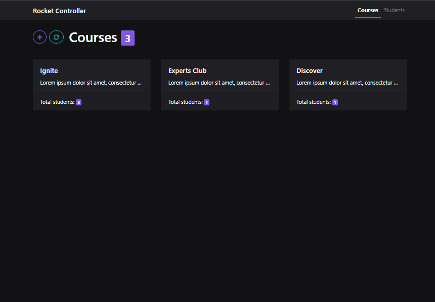
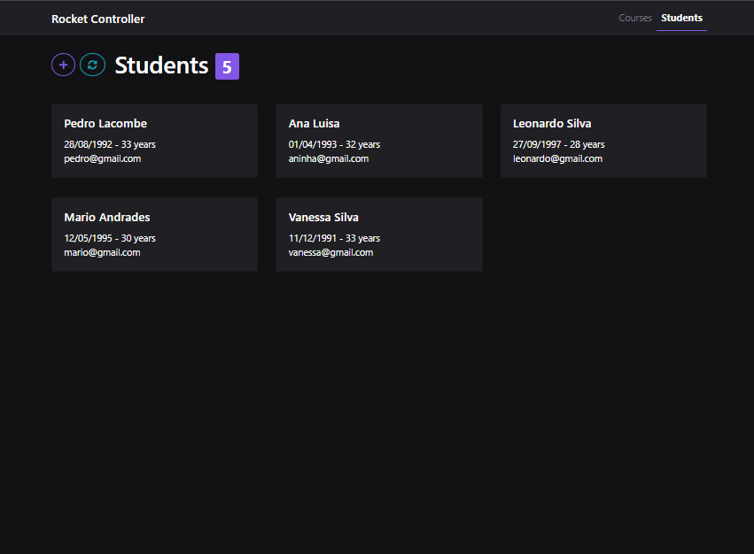

# Rocket Controler

O projeto **Rocket Controler** é uma aplicação desktop de gestão de cursos e alunos, listagem, adicionar, deletar, etidar e preview de cursos e alunos, aplicando boas práticas em aplicações Angular com Componentização, Pipes e Diretivas.

---



---



## Tecnologias usadas

<div align="center">

| Technology     | Descrição                                                     | Icon                                                                                       |
| -------------- | ------------------------------------------------------------- | ------------------------------------------------------------------------------------------ |
| **Angular**    | Framework robusto para construção de aplicações web modernas. |           |
| **TypeScript** | Superset tipado do JavaScript que facilita a escalabilidade.  |  |
| **Bootstrap**  | Framework CSS para criação rápida de interfaces responsivas.  |     |
| **CSS3**       | Linguagem de estilo para design e layout de páginas web.      |                    |

</div>

---

## Links úteis

- [Angular CLI](https://angular.io/cli)
    - [generate](https://angular.io/cli/generate)
- [NG Bootstrap](https://ng-bootstrap.github.io/#/home)
- [Font Awesome](https://fontawesome.com)
- [RxJS](https://rxjs.dev/guide/operators#creation-operators)
- [Date-Fns](https://date-fns.org/)

## Comandos utilizados
- npm install –save date-fns
- ng generate pipe shared/pipes/age
- ng generate pipe shared/pipes/shortName
- ng generate component shared/components/student-card-list
- ng generate component shared/components/select-course

## Testando a aplicação
- Clone o repositório para a sua máquina
- Abra um terminal na pasta principal da aplicação
- Instale todas as dependências da aplicação utilizando o seguinte comando:
    ```
    npm install
    ```
- Antes de inicializar nossa aplicação, é necessário subir nossa fake API (Back-end server):
    ```
    npm run server
    ```
- Para rodar a aplicação, execute o comando:
    ```
    npm start
    ```
- Abra o seu browser na seguinte URL: http://localhost:4200

_Esse projeto foi desenvolvido com ❤ pelo [João Tambue](https://github.com/joao-tambue)_
